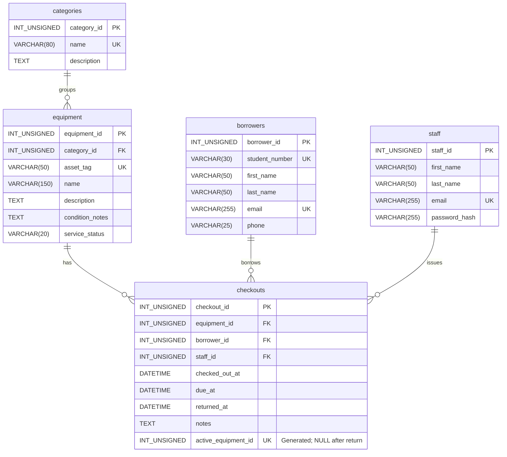

# Campus Equipment Checkout

## Data Model

```mermaid
erDiagram
    categories {
        INT_UNSIGNED category_id PK
        VARCHAR(80) name UK
        TEXT description
    }
    equipment {
        INT_UNSIGNED equipment_id PK
        INT_UNSIGNED category_id FK
        VARCHAR(50) asset_tag UK
        VARCHAR(150) name
        TEXT description
        TEXT condition_notes
        VARCHAR(20) service_status
    }
    borrowers {
        INT_UNSIGNED borrower_id PK
        VARCHAR(30) student_number UK
        VARCHAR(50) first_name
        VARCHAR(50) last_name
        VARCHAR(255) email UK
        VARCHAR(25) phone
    }
    staff {
        INT_UNSIGNED staff_id PK
        VARCHAR(50) first_name
        VARCHAR(50) last_name
        VARCHAR(255) email UK
        VARCHAR(255) password_hash
    }
    checkouts {
        INT_UNSIGNED checkout_id PK
        INT_UNSIGNED equipment_id FK
        INT_UNSIGNED borrower_id FK
        INT_UNSIGNED staff_id FK
        DATETIME checked_out_at
        DATETIME due_at
        DATETIME returned_at
        TEXT notes
        INT_UNSIGNED active_equipment_id UK "Generated; NULL after return"
    }
    categories ||--o{ equipment : groups
    equipment ||--o{ checkouts : has
    borrowers ||--o{ checkouts : borrows
    staff ||--o{ checkouts : issues
```

`INT_UNSIGNED` means `INT UNSIGNED` in MariaDB.
